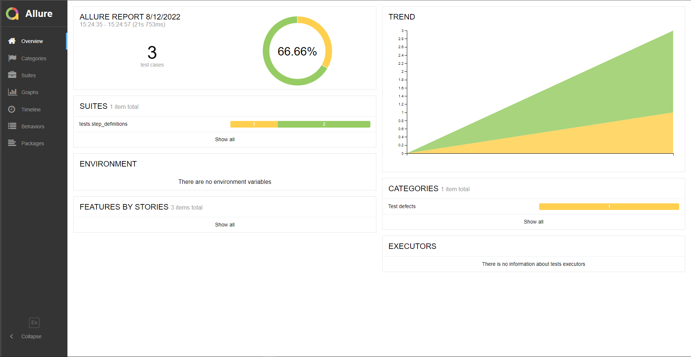
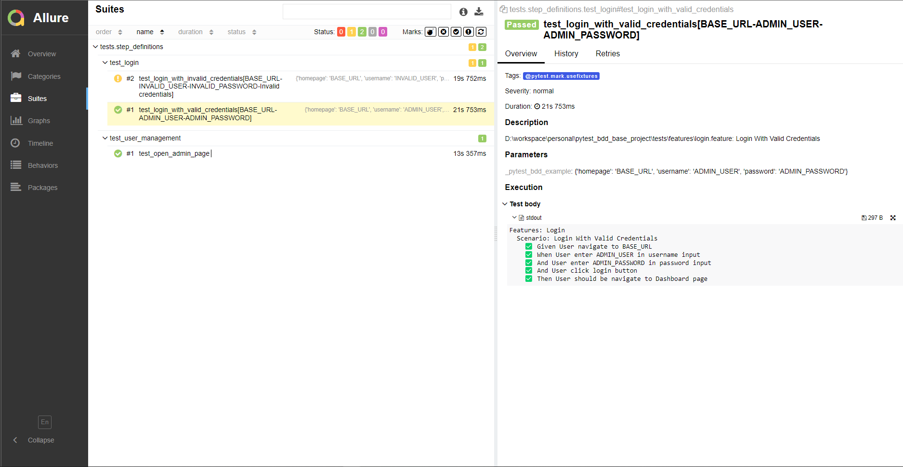
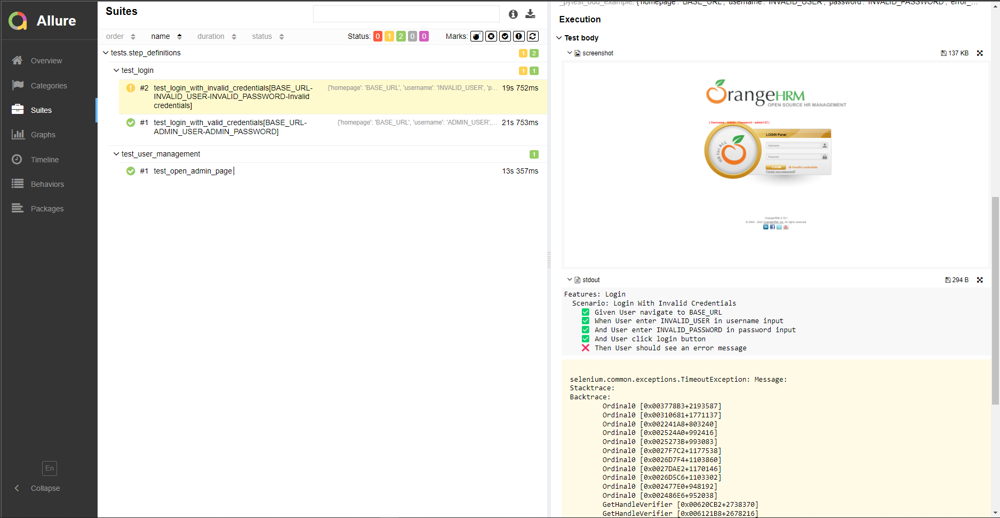

# pytest_bdd_base_project

Project template for Pytest BDD with Allure report

## Project Structure

    pytest_bdd_base_project/              # Project root directory
    ├── allure-report/                    # Allure report directory store the report generated by allure
    ├── config/                           # Contain config file for project 
    ├── core_lib/                         # Core library 
    ├── data/                             # Data root directory
    │   ├── api/                          # Store api test data
    │   └── e2e/                          # Store E2E test data
    ├── drivers/                          # Store the web drivers
    ├── locators/                         # Locators of web elements for each page
    ├── make_tree_path.py                 # Helper that help generate tree directory 
    ├── pom/                              # Page Object Model root directory
    │   ├── components/                   # Contains components of pages in website
    │   │   ├── base_page.py              # Contains list of function that work on page
    │   │   └── main_menu.py              # Contains list of function that work with main menu
    │   └── pages/                        # Root directory of implementing page object model
    │       ├── login.py                  # Login Page that contains all actions we can do on page
    │       └── user_management.py        # User Management Page that contains all actions we can do on page
    ├── resources/                        # Resources manager base directory
    │   ├── data_manager.py               # Used to manage all test data in project
    │   ├── driver_manager.py             # Used to manage web drivers
    │   └── locators_manager.py           # Used to manage all locators in project

    ├── tests/                            # Test base directory
    │   ├── features/                     # Contains all features that we want to test
    │   └── step_definitions/             # Contains all step definitions for each feature
    
    ├── .flake8                           # Configuration for flake8 tool
    ├── conftest.py                       # Setup test configurations used by test functions
    ├── generate_pom.sh                   # bash command file that help generate page object model 
    ├── pyproject.toml                    # Configuration for black tool
    ├── README.md                         # Readme
    ├── reformat_code.sh                  # bash command file that help reformat code + check linting
    ├── requirements.txt                  # Require libries that used to use
    └── run.sh                            # bash command file that contains steps to run test

## Usage

**Install Requirement Libraries**
- From `pytest_bdd_base_project` directory run

```bash
# use python3 if your os is MacOS / Ubuntu
python -m pip install -r requirements.txt
```

**Check code formatting**
```bash
black --check .
# sample output that contain files would be reformatted
would reformat pom\pages\login.py
would reformat conftest.py
would reformat make_tree_path.py
would reformat pom\components\base_page.py
Oh no! 💥 💔 💥
4 files would be reformatted, 9 files would be left unchanged.

# sample check that no file would be reformatted
All done! ✨ 🍰 ✨
13 files would be left unchanged.
```

**Auto format code with black**
```bash
black *.py
black */*.py
black */*/*.py
```

**Check linting with flake8**
```bash
flake8

# sample output that need to be fixed
.\make_tree_path.py:56:5: F811 redefinition of unused 'displayname' from line 20
.\make_tree_path.py:85:1: E402 module level import not at top of file
.\make_tree_path.py:88:1: E302 expected 2 blank lines, found 1

# if has no issues the output should be blank
```

**Generate page object model**

You can Generate source code for your page object model by entering it's key name in locators_manager
- Open `config/generate_page_conf.yaml` then modify:
```bash
LOCATOR_KEYNAME: login_page  # key name in locators_manager
OUTPUT_FOLDER: pom/pages     # output folder for pom. Default is pom/pages
```
- After configuring the config file from root directory run:
```bash
chmod a+x generate_pom.sh
./generate_pom.sh

# sample output
Code generated
Folder: [pom/pages]
File name: [login_page.py]
Check formatting
would reformat pom\pages\login_page.py

Oh no! 💥 💔 💥
1 file would be reformatted, 13 files would be left unchanged.
Reformat code
All done! ✨ 🍰 ✨
1 file left unchanged.
All done! ✨ 🍰 ✨
6 files left unchanged.
reformatted pom\pages\login_page.py

All done! ✨ 🍰 ✨
1 file reformatted, 6 files left unchanged.
Check formatting
All done! ✨ 🍰 ✨
14 files would be left unchanged.
Check Linting
```

- You can config more template to generate by creating a code template in `core_lib/generate_page_from_locators.py` and put it in `templates` list

## Run Test And Generate Report
### Run Test
- First of all we have to remove previous running report by running
```bash
rm -rf allure-report
```
- Then re generate a new `allure-report` by running
```bash
allure generate
# it would generate a report folder named allure-report
```
- We have many ways to run tests:

**Run all tests**
```bash
pytest --cov . --alluredir=allure-report/
```

**Run single file**
```bash
pytest --cov . --alluredir=allure-report/  tests/step_definitions/<your_test_step.py>
```

**Run Parallel**
```bash
pytest -n <number_of_processes> --cov . --alluredir=allure-report/
```

### Generate report
- As we can see in running command we have `--alluredir=allure-report/`
- That mean the test report store in `allure-report` directory
- To view report we run the following command
```bash
allure serve allure-report

# sample output
Generating report to temp directory...
Report successfully generated to C:\Users\Admin\AppData\Local\Temp\4897534096339945534\allure-report
Starting web server...
2022-08-12 15:12:53.657:INFO::main: Logging initialized @3145ms to org.eclipse.jetty.util.log.StdErrLog
Server started at <http://192.168.33.4:61671/>. Press <Ctrl+C> to exit
```

_Sample allure report overview_

- It shows overview that how many scenarios passed / broken / failed

_Sample allure report on passed Scenario_

- It shows you which Feature and which Scenario and all passed Steps in Execution test body

_Sample allure report on failed Scenario_

- It takes screenshot on where if failed
- And show you exact failed step in your Scenario